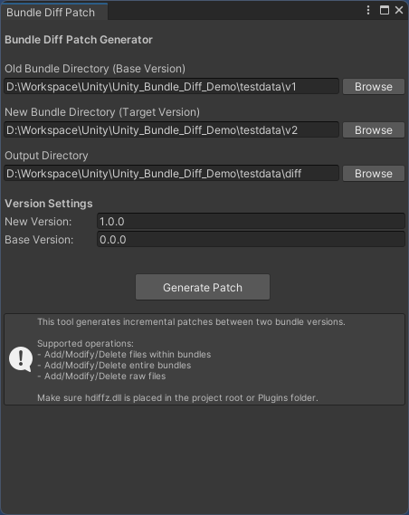
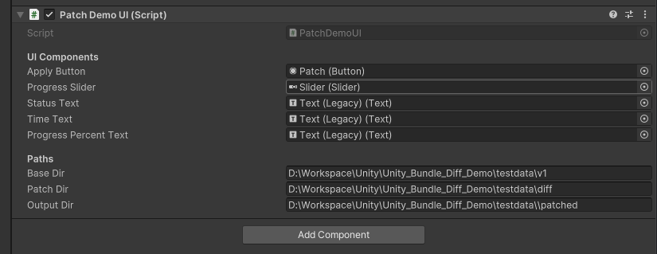
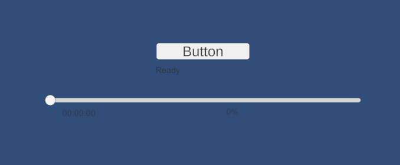

# Unity Bundle Diff Demo

Unity AssetBundle 增量热更新的可行性验证 Demo。

通过解析 Bundle 容器格式，提取内部未压缩文件（SerializedFile / ResourceFile），在内部文件粒度上进行 diff/patch，然后重新打包 Bundle。

## 依赖

- [UnityAsset.NET](https://www.nuget.org/packages/UnityAsset.NET) — Bundle 解析和重新打包。Unity 本身只提供了重新压缩 Bundle 的接口，无法直接按容器操作 Bundle 内的文件，而且不支持内存中处理数据，必须先解压到磁盘上，效率较低
- [SharpHDiffPatch.Core](https://www.nuget.org/packages/SharpHDiffPatch.Core) — [HDiffPatch](https://github.com/sisong/HDiffPatch) 的 C# 实现，支持 netstandard2.0，但只支持 patch
- [HDiffPatch](https://github.com/sisong/HDiffPatch) — 二进制文件 diff/patch 工具（C++ 实现，性能更优）

## 使用

### 生成 Patch 包（Editor 端）

在 Editor 端运行 `Tools` -> `Bundle Diff Patch` -> `Generate Patch`，选择旧版本和新版本的 Bundle 目录，输出 patch 包目录：



## 运行时Patch

在 `Scenes` 中的 `SampleScene` 场景中，修改 `Canvas` 上挂载的 `Patch Demo UI` 组件的路径



在运行时点击场景中的按钮对 Bundle 进行 patch



## 测试

先下载测试数据（数据来着碧蓝航线某两个版本之间的 Bundle），再运行端到端测试：

```shell
uv run download_testdata.py
```

然后按前述步骤生成 patch 包，并在运行时应用 patch

可以通过如下命令通过hash校验patch后的文件是否与v2一致：

```shell
uv run verify.py
```

输出
```shell
结果: 520 一致, 21 不一致, 0 仅v2, 0 仅patched
```

使用hash校验patch后的文件是否与v2一致，结果显示520个文件一致，21个文件不一致，没有文件仅存在于v2或patched版本中。

存在hash不一致是原bundle打包时的压缩等级和参数与重新打包时的不同导致的。

### 对比

分别使用 `DiffDemo`, `HDiffPatch` 对单个文件逐个diff以及整个文件夹diff，对比生成的patch文件大小(使用zstd压缩)：

| 新文件总大小 | DiffDemo | HDiffPatch(整个文件夹) |
| ---------- |----------|-------------------|
| 273.29 MB | 87.93 MB | 91.24 MB          |

| 新文件总大小 | DiffDemo | HDiffPatch(对修改过的文件逐个diff，不包括删除和新增文件) |
| ---------- |----------|--------------------------------------|
| 260.91 MB | 75.30 MB | 80.85 MB                             |

## 原理

Unity AssetBundle 本质上是一个容器格式，内部包含多个文件：

- **SerializedFile**（如 `CAB-0e60c917fc98b767ebaa46aaaabe32fd`）— 序列化的 Unity 对象数据
- **ResourceFile**（如 `CAB-0e60c917fc98b767ebaa46aaaabe32fd.resS`）— 纹理、音频等大型资源数据

通常打包后的 Bundle 是压缩的（LZ4/LZMA），直接对压缩数据做 diff 效果很差。本方案的核心思路：

1. **Editor 端**：使用 UnityAsset.NET 解析 Bundle，提取未压缩的内部文件，在内部文件粒度上生成 diff，输出 patch 清单和 diff 文件
2. **Runtime 端**：读取 patch 清单，加载旧版本 Bundle，对内部文件逐个应用 patch，然后使用 UnityAsset.NET 重新打包为合法的 Bundle 文件

```
Editor Pipeline:
  旧版本 Bundle 目录 ──┐
                        ├─ 解析 Bundle → 提取内部文件 → 对比 → 生成 diff → 输出清单 + patches/
  新版本 Bundle 目录 ──┘

Runtime Pipeline:
  当前版本 Bundle 目录 ─── 解析 Bundle → 按清单应用 patch → 重新打包 Bundle → 输出新版本
```

### Q&A

**Q: 为什么不直接对压缩后的 Bundle 做 diff？**

压缩算法（LZ4/LZMA）会放大数据差异。即使原始数据只改了几个字节，压缩后的二进制可能完全不同，导致 diff 体积接近整个文件大小，失去增量更新的意义。对未压缩数据做 diff 能获得更小的 patch 体积。

**Q: 为什么不直接使用 Unity 的 `AssetBundle.RecompressAssetBundleAsync` 接口获取未压缩数据？**

该接口只能将整个 Bundle 重新压缩到磁盘文件，无法在内存中按内部文件粒度操作。而且它是异步文件 I/O 操作，不支持部分读取，必须处理整个 Bundle。UnityAsset.NET 可以直接在内存中解析容器结构，按需读取单个内部文件的未压缩数据，更灵活高效。

## 问题

- **性能**：目前实现是单线程的，而且全内存处理，假定不对大文件进行patch（HDiffPatch和UnityAsset.NET本身支持流式处理，但需要额外实现）。
- **兼容性**：目前只测试了 Windows x64 平台。
- **缺少实际项目验证**：目前只是对两个版本的测试 Bundle 进行 diff/patch 验证，缺乏在实际项目中的验证，后续可以在真实项目中集成测试，验证兼容性和性能，以及更多的功能和需求。